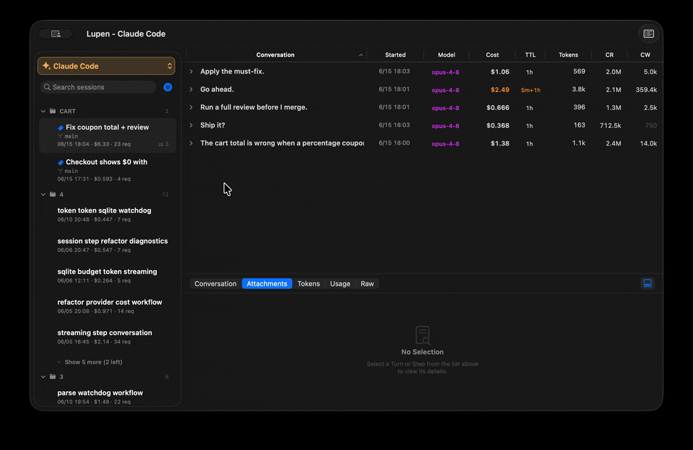
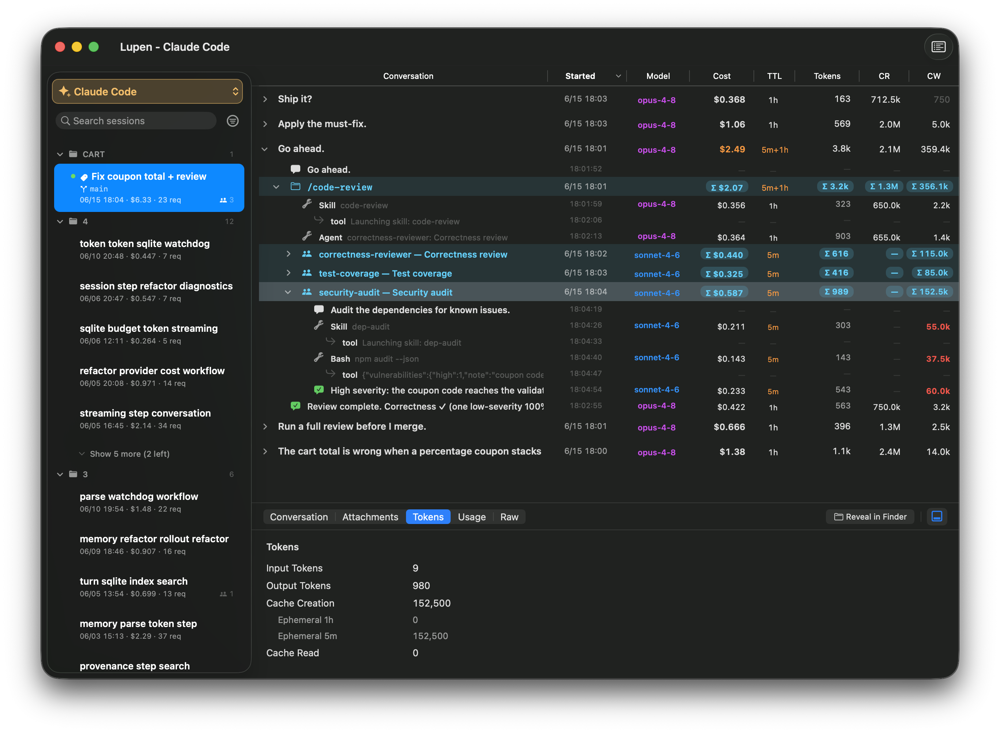
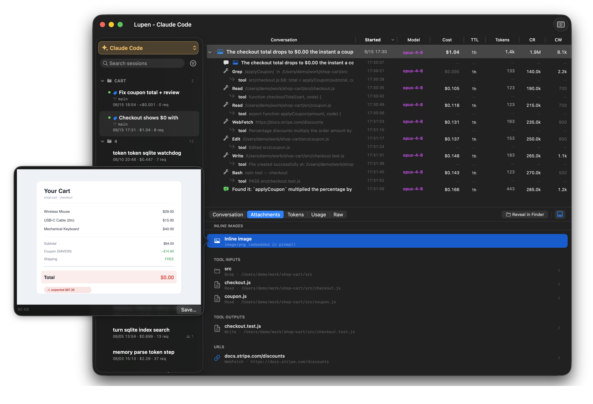
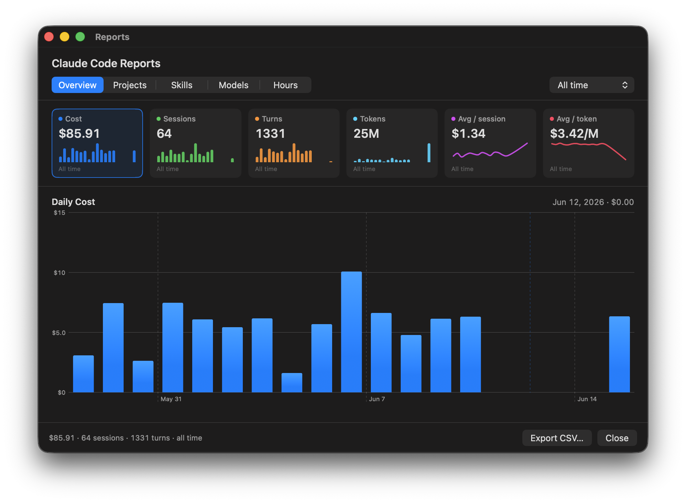
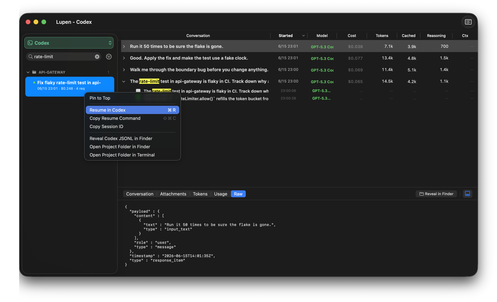

<p align="center">
  <!-- Self-contained dark-navy plate: renders as-is on light AND dark pages. -->
  
</p>

<h3 align="center">See what every Claude Code and Codex session actually costs — itemized, verified, local.</h3>

<p align="center">
  <em>Lupen recomputes your spend straight from the raw Claude Code and Codex logs — broken down by turn, step, and sub-agent, checked against the tokens, and never leaving your Mac.</em>
</p>

<p align="center">
  
  
  
  <a href="https://github.com/momoraul/Lupen/actions/workflows/ci.yml"></a>
  <a href="https://github.com/momoraul/Lupen/releases/latest"></a>
</p>

<p align="center">
  
</p>

<!-- Hero is a ≤5 MB looping GIF (drill-down through priced rows), recorded on synthetic demo data. Swap docs/demo.gif to update. -->

> **Install:** `brew install --cask momoraul/lupen/lupen` — or grab the [signed DMG](https://github.com/momoraul/Lupen/releases/latest). Requires macOS 26 (Tahoe) on Apple Silicon.

---

## What it shows

Your AI coding spend says `$50 today`. Which provider was it? Which session?
Which turn? Which sub-agent or tool loop? A daily total can't answer that, so
Lupen breaks the number down and recomputes each cost from the raw tokens.

- **Provider-scoped totals** — `$50 today · Claude Code · 12 sessions · 84 turns`. Claude Code and Codex stay in separate modes instead of one mixed list.
- **Cost per Turn, Step, SkillGroup, and SubAgent**, where the data allows it.
- **Recomputed, then diffed** — each cost is recomputed from raw tokens and the public price table and compared to the reported total, so any difference is shown rather than assumed.
- **Origin-tagged attachments** — every file, image, and URL is labelled by where it entered the context.
- **Sub-agent cost** rolls up into the parent turn and stays attributable on its own.

## Gallery

<table>
  <tr>
    <td width="50%" valign="top">
      <a href="docs/screenshots/00-hero.png"></a>
      <sub><b>The itemized receipt.</b> Drill from a session total down to each turn, skill group, and sub-agent — every row priced and attributable on its own.</sub>
    </td>
    <td width="50%" valign="top">
      <a href="docs/screenshots/04-attachments.png"></a>
      <sub><b>Origin-tagged attachments.</b> Every file, image, and URL is labelled by where it entered the context.</sub>
    </td>
  </tr>
  <tr>
    <td width="50%" valign="top">
      <a href="docs/screenshots/03-reports.png"></a>
      <sub><b>Daily spend, per provider.</b> Cost, sessions, turns, and tokens over time.</sub>
    </td>
    <td width="50%" valign="top">
      <a href="docs/screenshots/05-codex.png"></a>
      <sub><b>Searchable and resumable.</b> Find a past session by any prompt it contains, then pick up right where you left off.</sub>
    </td>
  </tr>
</table>

## Key features

- **Provider mode** — Choose Claude Code or Codex. Lupen shows only that provider's sessions, conversations, dropdown totals, reports, diagnostics, and verification results.
- **Cost drift verification** — Run the **Verify Usage** window to recompute every cost from raw tokens and the public price table, then diff it against the reported total; any difference is flagged. Claude Code is checked against its per-request totals; Codex gets an independent local verifier over rollout `token_count` events.
- **Search and resume** — Full-text search finds a session by any prompt it contains (across every turn), plus its project and slug. Reopen any result in Claude Code (or Codex) to pick up where you left off — Lupen runs `claude --resume` / `codex resume` in a new Terminal window, or copies the command for you.
- **Turn boundaries that match Anthropic's API** — Lupen uses `stop_reason` to mark Turn boundaries instead of timestamps. Tool-use loops stay inside one Turn instead of fragmenting into a dozen rows.
- **Codex rollout support** — Lupen reads `~/.codex/sessions/YYYY/MM/DD/rollout-*.jsonl`, normalizes cached input, preserves reasoning tokens, handles cumulative token deltas, and watches new day folders live.
- **Sub-agent cost rollup** — When a Turn spawns sub-agents, their cost rolls up into the parent in the outline but stays separately attributable in the detail pane. The aggregate and the per-agent figures come from the same source, so they stay consistent.
- **Origin-tagged attachment tracking** — File paths, image bytes, and URLs are classified by where they entered the conversation (inline prompt, tool input, tool output, reply, …) so you can see what's filling the context window.
- **5-hour limit tracking** — A Bayesian estimate of `$ per 1 % of limit consumed` across your last 7 days, surfaced in the menu-bar icon's ring tint (yellow at 70 %, orange at 90 %, red at 100 %).
- **Zero network** — Lupen only reads local Claude Code and Codex files on disk. No API keys, no telemetry, no cloud sync.

## Install

```bash
brew install --cask momoraul/lupen/lupen
```

…or grab the signed DMG from the [latest release](https://github.com/momoraul/Lupen/releases/latest). Both are notarized and keep themselves up to date via Sparkle.

### Build from source

```bash
git clone https://github.com/momoraul/Lupen.git
cd Lupen
cp Config/Local.xcconfig.example Config/Local.xcconfig  # set DEVELOPMENT_TEAM
xcodebuild build -project Lupen.xcodeproj -scheme Lupen -destination 'platform=macOS'
open ~/Library/Developer/Xcode/DerivedData/Lupen-*/Build/Products/Debug/Lupen.app
```

## Why I built this

A single Claude Code session once cost me more than the rest of the day combined,
and the daily total couldn't tell me which turn — or which runaway sub-agent —
ate the money. Lupen is the itemized receipt I wanted: every turn priced, and
every price checked against the raw tokens, without anything leaving my Mac.

## Privacy

Lupen reads local session files on your Mac:

- Claude Code: `~/.claude/projects/**/*.jsonl`
- Codex: `$CODEX_HOME/sessions/**/rollout-*.jsonl` or `~/.codex/sessions/**/rollout-*.jsonl`

It makes **zero network requests**. No telemetry, no analytics, no cloud sync.
Your conversations, prompts, file paths, and attachments never leave your
machine. The `Info.plist` carries no `NSAppTransportSecurity` block because
Lupen opens no sockets — you can confirm this with Little Snitch or any
outbound-connection monitor.

Detailed model: [SECURITY.md](SECURITY.md).

## Requirements

- macOS 26 (Tahoe) or later, Apple Silicon
- Xcode 26 with Swift 6 (build from source only)
- An active Claude Code or Codex installation with local session data

## Docs

- [`docs/CLAUDE-CODE-TOKEN-GUIDE.md`](docs/CLAUDE-CODE-TOKEN-GUIDE.md) — `~/.claude/projects/` JSONL schema + token-field interpretation.
- [`docs/CODEX-LOCAL-DATA.md`](docs/CODEX-LOCAL-DATA.md) — `~/.codex/sessions/` rollout JSONL schema + token-field interpretation.
- [`docs/TOKEN-BILLING-EXPLAINED.md`](docs/TOKEN-BILLING-EXPLAINED.md) — How Anthropic's token counts, cache savings, and billable totals relate.

## Contributing

See [CONTRIBUTING.md](CONTRIBUTING.md) for the workflow, commit style,
and how to file a bug with a sanitised JSONL repro.

## License

MIT. Copyright © 2026 jaden (@momoraul). See [LICENSE](LICENSE).

Lupen is an independent project. It is **not affiliated with Anthropic or
OpenAI**; it only reads local log files written to your machine.

## Acknowledgments

- [Sparkle](https://sparkle-project.org) — auto-update framework (MIT).
- [GRDB.swift](https://github.com/groue/GRDB.swift) — SQLite toolkit for the on-device index (MIT).

## Changelog

### v0.3.0 — _2026-06-17_

First public release. Highlights:

- Session → Turn → Step → SkillGroup → SubAgent outline with per-row cost and 4-way token breakdown
- Provider mode for Claude Code and Codex
- Codex rollout JSONL parsing with cached-input normalization, reasoning tokens, cumulative dedup, fork replay handling, and live watching
- `CostVerifier` / `Verify Usage` — provider-aware independent scans for local accounting confidence
- 5-hour-limit tracking with Bayesian shrinkage (`$ per 1 % limit`) and severity-tinted menu-bar icon
- Origin-tagged attachment classification with inline image preview
- Snapshot cache for incremental launch (full reparse only when the schema bumps)
- Sparkle 2 auto-update, with a signed appcast hosted on GitHub Pages
- Status-item rendered as a single attributed run — no icon-text gap on macOS 26
