# Claude Code Tokens, Cache, Context, and Usage Limits — A Complete Guide

A reference for understanding the cost and quota model behind Claude Code.

---

## Table of contents

1. [What is a token](#1-what-is-a-token)
2. [The four token kinds](#2-the-four-token-kinds)
3. [Prompt Caching — the heart of cost reduction](#3-prompt-caching--the-heart-of-cost-reduction)
4. [Context Window — what every request really sends](#4-context-window--what-every-request-really-sends)
5. [Context impact of MCP, Skills, and Rules](#5-context-impact-of-mcp-skills-and-rules)
6. [Usage Limits](#6-usage-limits)
7. [What local data can tell you](#7-what-local-data-can-tell-you)
8. [Cost optimisation guide](#8-cost-optimisation-guide)
9. [End-to-end example: the full journey of "fix the bug"](#9-end-to-end-example-the-full-journey-of-fix-the-bug)
10. [Summary and workflow checklist](#10-summary-and-workflow-checklist)
11. [References](#11-references)

---

## 1. What is a token

A token is the smallest unit by which Claude processes text. As a rule of thumb, English is about 4 characters per token; Korean is roughly 1–2 tokens per character.

The Claude API is **stateless**. No conversation state is stored on the server, so **every request must carry the entire conversation history**.

```
Request 1: [system + tools + "hi"]                       → response A  (small context)
Request 2: [system + tools + "hi" + A + "next"]          → response B  (context grows)
Request 3: [system + tools + full history + "another"]   → response C  (context keeps growing)
```

This is why longer conversations cost more, and why **Prompt Caching** is essential.

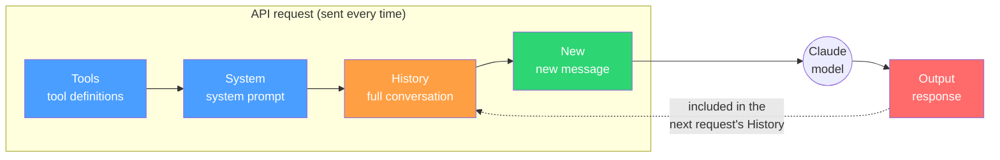

---

## 2. The four token kinds

The `usage` object in a Claude API response carries four token fields:

```json
{
  "usage": {
    "input_tokens": 3,
    "output_tokens": 44,
    "cache_creation_input_tokens": 229,
    "cache_read_input_tokens": 368518
  }
}
```

### What each field means

| Field | Meaning | Cost multiplier |
|------|------|----------|
| `input_tokens` | Input tokens not covered by cache | 1x |
| `output_tokens` | Tokens the model **generated** | 5x (vs. input) |
| `cache_creation_input_tokens` | Tokens **newly written** to the cache by this request | 1.25x–2x |
| `cache_read_input_tokens` | Tokens **read** from the cache | **0.1x** |

### Key formulas

```
total input context = input + cache_creation + cache_read
total cost          = input × rate + output × 5×rate + cache_create × (1.25..2)×rate + cache_read × 0.1×rate
```

### A worked example: the single word "test"

```
Input Tokens:          3         ← newly sent tokens
Output Tokens:        44         ← Claude's response
Cache Creation:      229         ← newly added to the cache
Cache Read:      368,518         ← prior context read from the cache

Total Context:   368,794 tokens
Effective:            47 tokens (input + output, real new work)
```

Sending those 368,518 tokens without cache would cost **$1.84**; with cache **$0.184** → **90% savings**.

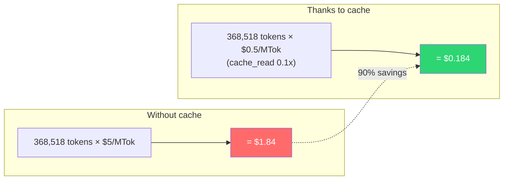

---

## 3. Prompt Caching — the heart of cost reduction

### How it works

```
Request 1: [System(14K) + Tools(5K) + User(1) + Asst(1) + User(2)]
           ─────────── stored in cache (cache_creation) ───────────

Request 2: [System(14K) + Tools(5K) + User(1) + Asst(1) + User(2) + Asst(2) + User(3)]
           ────────── read from cache (cache_read) ──────────  ── newly stored ──

Request 3: same pattern repeats... cache_read ratio keeps climbing
```

As the conversation continues the **cache_read share rises past 99%** and cost drops dramatically.

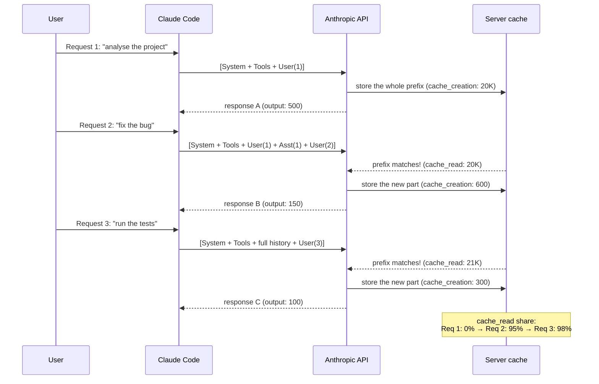

### Cache tiers (TTL vs. cost trade-off)

When you write to the cache you choose a **TTL**. Longer-lived caches cost more to write, but pay off if many cache_read hits follow.

| Type | TTL | Write cost | Read cost |
|------|---------|----------|----------|
| Ephemeral 5m (default) | 5 minutes | **1.25x** (vs. input) | 0.1x |
| Ephemeral 1h | 1 hour | **2x** (vs. input) | 0.1x |

**The premium is paid at write time only; reads are equally 0.1x for both tiers.** ([official docs](https://platform.claude.com/docs/en/build-with-claude/prompt-caching))

The only difference is **TTL**:
- **5-minute cache** (default): cheaper to write, but if no follow-up request arrives within 5 minutes the cache expires and has to be written again.
- **1-hour cache**: twice as expensive to write, but it survives an hour, so even after a short break the next request still gets cache_read.

```
Scenario: cache a 20K-token system prompt

5-minute cache:  write $0.025 (1.25x) → read within 5 min $0.002 (0.1x) ✓
                 after 5 min → expire → re-write $0.025

1-hour cache:    write $0.040 (2x) → keep reading within 1 hour $0.002 (0.1x) ✓
                 step away for a coffee and the cache is still there ✓
```

**TTL is specified by the client at request time** ([official docs](https://platform.claude.com/docs/en/build-with-claude/prompt-caching)). The default is 5 minutes; pass `"cache_control": {"type": "ephemeral", "ttl": "1h"}` to ask for 1 hour. Any API caller can specify it, regardless of plan.

**Behaviour in Claude Code**: the Claude Code client picks the TTL internally. The current session's JSONL shows only `ephemeral_1h_input_tokens` populated with `ephemeral_5m_input_tokens: 0`, which suggests this environment (Max plan) is using the 1-hour TTL. Whether the client switches automatically by plan or always uses 1 hour is not officially documented.

Checking which tier is in effect from the JSONL:
```json
"cache_creation": {
  "ephemeral_1h_input_tokens": 229,   ← Max plan → 1-hour tier
  "ephemeral_5m_input_tokens": 0      ← 5-minute tier not used
}
```

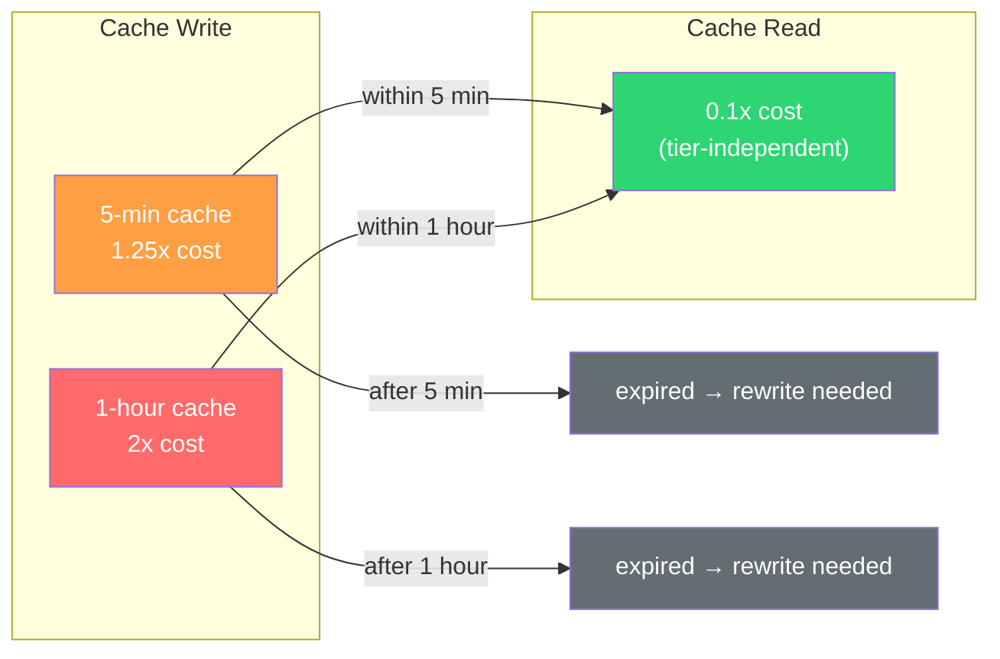

### TTL refresh rules and real scenarios

**The cache TTL resets every time it is read.** The countdown restarts from the last hit.

```mermaid
gantt
    title Max plan (1h TTL) — a day's work timeline
    dateFormat HH:mm
    axisFormat %H:%M

    section Morning
    start work (cache creation $0.04)     :crit, 09:00, 1m
    requests (cache_read $0.002 each)     :active, 09:01, 119m

    section Lunch
    lunch (1 hour 20 min)                  :11:00, 80m

    section Afternoon
    back at desk (cache re-creation $0.04) :crit, 12:20, 1m
    requests (cache_read $0.002 each)      :active, 12:21, 99m

    section Break
    coffee break (30 min)                  :14:00, 30m

    section Afternoon continued
    back (cache still alive, within TTL)   :done, 14:30, 1m
    requests (cache_read $0.002 each)      :active, 14:31, 89m
```

#### Scenario 1: focused work (cache stays warm)

```
09:00  start → cache_creation 20K tokens ($0.040)  ← first cost
09:05  request → cache_read ($0.002) ✅  TTL reset → until 10:05
09:12  request → cache_read ($0.002) ✅  TTL reset → until 10:12
09:30  request → cache_read ($0.002) ✅  TTL reset → until 10:30
 ...
10:50  request → cache_read ($0.002) ✅  TTL reset → until 11:50

→ in 2 hours: 1 cache_creation + dozens of cache_read hits
→ total cost: $0.04 + $0.002 × 30 = $0.10
```

#### Scenario 2: back from lunch (cache expired)

```
10:50  last request → TTL reset → valid until 11:50
11:00  lunch
12:20  back at desk → cache expired (expired at 11:50)
12:20  request → cache_creation again ($0.040)  ← re-creation cost
12:25  request → cache_read ($0.002) ✅

→ lunch break 1h 20min > TTL 1h → re-creation needed
```

#### Scenario 3: short break (cache survives)

```
14:00  last request → TTL reset → valid until 15:00
14:00  coffee break (30 min)
14:30  back → cache still alive (valid until 15:00)
14:30  request → cache_read ($0.002) ✅  TTL reset → until 15:30

→ break 30 min < TTL 1 hour → no re-creation needed
```

#### Costly patterns vs. cheap ones

| Pattern | Cache re-creations | Extra cost per day |
|------|-----------------|--------------|
| **4 hours of focused work** | 1 | $0.04 |
| **30 min work / 30 min break repeated** | 1 (within TTL) | $0.04 |
| **1 hour work / 2 hour break repeated** | every time | $0.04 × 3-4 = $0.16 |
| **frequent new sessions** (`/clear`, new terminal) | every time | $0.04 × count |
| **changing MCP servers mid-session** | full re-creation | $0.04+ (history included) |

> **Tip**: stepping away for more than an hour costs a cache re-creation ($0.04), but that is a tiny share of the bill. **Avoiding MCP changes** and **avoiding unnecessary /clear** matter far more than micro-optimising this.

### When the cache is invalidated

| Change | Effect |
|----------|------|
| Tool definitions change (MCP added/removed) | **Whole** cache invalidated |
| System prompt change (edit CLAUDE.md) | Everything after system invalidated |
| Conversation history change | Only the suffix from the change point invalidated |
| Nothing changes | Cache stays ✓ |

The cache uses **prefix matching** in the order `tools → system → messages`, so a change in tools breaks everything downstream.

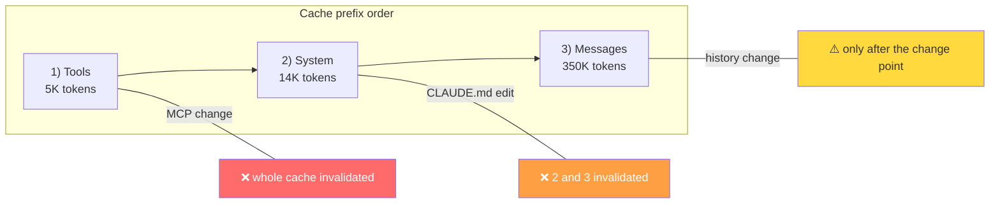

### Minimum cacheable token count

| Model | Minimum tokens |
|------|----------|
| Opus 4.6/4.5 | 4,096 |
| Sonnet 4.6, Haiku 3.5 | 2,048 |
| Sonnet 4.5/4, Opus 4.1, Haiku 4.5 | 1,024 |

---

## 4. Context Window — what every request really sends

### Context window sizes

| Model | Context | Max output |
|------|---------|------------|
| Opus 4.6 | **1,000,000** (1M) | 128K |
| Sonnet 4.6 | **1,000,000** (1M) | 64K |
| Haiku 4.5 | 200,000 (200K) | 64K |

### Context components

What every API request carries:

```
┌──────────────────────────────────────────────────┐
│ 1. Tools (tool definitions) ~5K–55K tokens       │  ← grows with the number of MCP tools
│ 2. System Prompt            ~14K tokens          │  ← Claude Code base instructions
│    └ CLAUDE.md              variable             │  ← included every request
│    └ .claude/rules/         variable             │
│ 3. Conversation history     grows with session   │  ← every prior turn
│ 4. New Message              small                │  ← current prompt
├──────────────────────────────────────────────────┤
│ 5. Output                   model-generated      │  ← response
└──────────────────────────────────────────────────┘
```

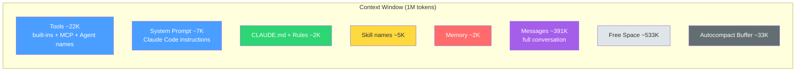

> Numbers above are from the live `/context` output of the current session (426K / 1M used, 43%).

### Auto-compaction

Before the context fills up, Claude Code automatically summarises the conversation ([official docs](https://code.claude.com/docs/en/costs)):

- Old conversation is compressed into a summary
- Irreversible — original detail is lost
- The threshold is adjustable via the `CLAUDE_AUTOCOMPACT_PCT_OVERRIDE` env var (1–100)

---

## 5. Context impact of MCP, Skills, and Rules

### MCP servers

MCP tool definitions are added to the `tools` array and **take up context on every request**.

| Impact | Detail | Source |
|------|------|------|
| System tools in this session | ~22K tokens | `/context` measurement |
| Custom agent names in this session | ~7.8K tokens | `/context` measurement |
| Cache effect | If tools do not change, they are reused via cache_read ✓ | [official docs](https://platform.claude.com/docs/en/build-with-claude/prompt-caching) |
| Cache breakage | Adding/removing an MCP server **invalidates the entire cache** ✗ | same source |

**Tool Search optimisation**: when tools take up more than 10% of the context, Claude Code automatically loads only the tool names and pulls in the full definition only on call ([Claude Code docs](https://code.claude.com/docs/en/costs)).

### CLAUDE.md / Rules

```
┌─ System Prompt ──────────────────────────────┐
│  Claude Code base instructions  ~14K tokens   │
│  + CLAUDE.md contents          +α tokens      │  ← included every request
│  + .claude/rules/ contents     +α tokens      │  ← retained even after compaction
└──────────────────────────────────────────────┘
```

- CLAUDE.md is folded into the system prompt and is **never summarised**.
- A large CLAUDE.md → more cache_read tokens per request.
- **Recommendation: keep it under 200 lines.**

### Skills / Agents

- When a Skill runs, the Skill's full prompt is appended to the conversation history.
- When a sub-agent runs, it uses its own separate context window (independent of the parent).
- However the result is returned into the parent context, so indirect context growth still happens.

---

## 6. Usage Limits

### Two-layer structure

| Layer | Window | Purpose |
|--------|--------|------|
| **5-hour rolling** | 5 hours | Limit burst activity |
| **7-day weekly** | 7 days | Cap total usage |

### Multipliers by plan

| Plan | Multiplier | Monthly price |
|------|------|---------|
| Pro | 1x (baseline) | $20 |
| Max 5x | 5x | $100 |
| Max 20x | 20x | $200 |

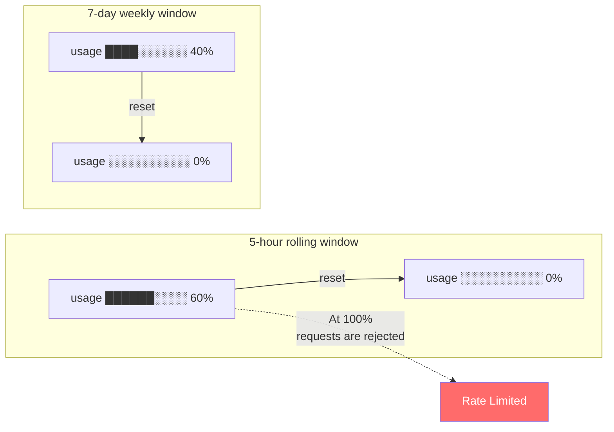

### Key facts

- **The absolute limit values are not public** — Anthropic only exposes percentages ([official docs](https://support.claude.com/en/articles/11145838)).
- The accounting basis is undocumented. Whether it is tokens or cost is not confirmed (cannot be inferred).
- Hitting 100% causes requests to be rejected (rate limit) ([official docs](https://code.claude.com/docs/en/costs)).
- The counters reset automatically at `resets_at`.

### Reading the statusline

Claude Code's statusline JSON:
```json
{
  "rate_limits": {
    "five_hour": {
      "used_percentage": 42.0,
      "resets_at": 1742651200
    },
    "seven_day": {
      "used_percentage": 18.0,
      "resets_at": 1743120000
    }
  }
}
```

---

## 7. What local data can tell you

### JSONL file location

```
~/.claude/projects/{encoded-project-path}/{session-uuid}.jsonl
```

### Knowable

| Item | Accuracy | How |
|------|--------|------|
| The 4 token counts per request | exact | `usage` on entries where `stop_reason != null` |
| Cost per cache tier | exact | distinguishing ephemeral_1h / ephemeral_5m |
| Per-model pricing | exact | `model` field + PricingTable |
| Fast-mode distinction | exact | `speed` field |
| Per-session / per-project totals | exact | `sessionId` + file path |
| Cache efficiency ratio | exact | cache_read / total_input |

### Not knowable

| Item | Reason |
|------|------|
| Usage Limit % | Not present in JSONL. Requires a statusline bridge |
| The exact limit values | Not published by Anthropic |
| Web Search cost | No search-count data |
| Code Execution cost | No execution-time data |
| Usage from other devices | Local files only reflect the current device |

### What Lupen provides

- Per-session token / cost monitoring in real time
- 4-way token classification + per-cache-tier cost calculation
- Per-request detail (Tokens / Conversation / Usage / Raw tabs)
- Per-project cost aggregation
- Live updates (DispatchSource-based)
- Usage limit percentage — not yet (planned via a statusline bridge)

---

## 8. Cost optimisation guide

### Tips you can apply today

| Action | Impact | Why |
|------|------|------|
| Keep CLAUDE.md under 200 lines | medium | included every request, so smaller is better |
| Remove unused MCP servers | high | ~710 tokens per tool, plus cache-invalidation risk |
| Don't change MCP servers mid-session | high | tools change → the whole cache is invalidated |
| Use `/compact` at the right moment | medium | manual summarisation before auto-compaction kicks in |
| Excerpt large files instead of sending them whole | medium | full file ≫ only what you need |
| Use sub-agents | high | separate context window → saves parent context |

### Understanding the cost structure

In a long Claude Code session:
- About **99%** of tokens are `cache_read` (0.1x rate)
- About **0.5%** are `cache_creation` (1.25–2x rate)
- About **0.5%** are `input` + `output` (1x–5x rate)

**Most of the actual cost comes from cache_read.** It is only 0.1x per token, but the volume is overwhelming.

---

## 9. End-to-end example: the full journey of "fix the bug"

This section traces what actually happens, end to end, when a user types `fix the bug` into Claude Code.

> The token counts and prices in this section are an **illustrative scenario** to explain the flow. Real values vary with session length, model, and cache state. For real measurements see chapter 2.

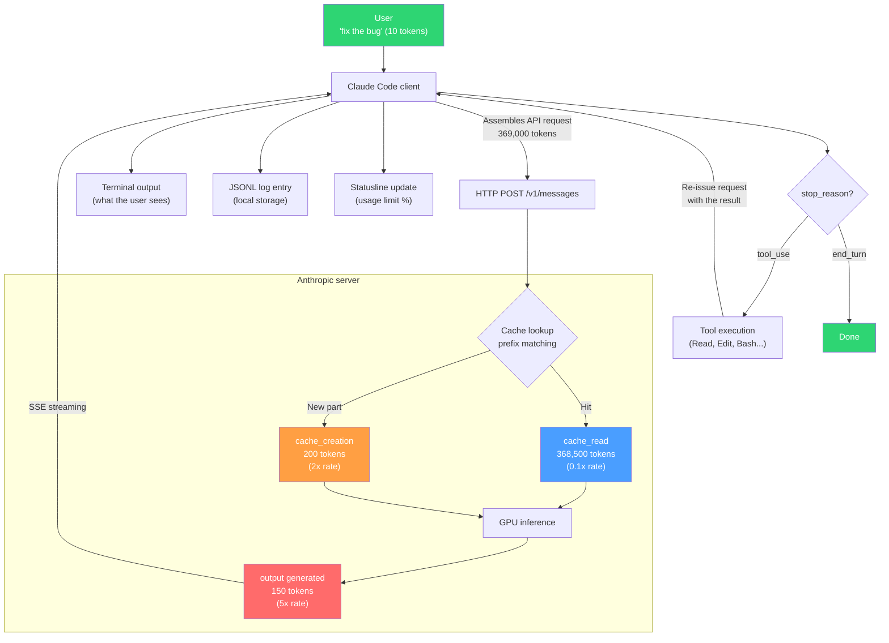

### Step 1: user input

```
$ claude
> fix the bug
```

The user types only those few characters (~10 tokens).

### Step 2: Claude Code assembles the API request

The Claude Code client expands that 10-token message into a **large API request**:

```json
{
  "model": "claude-opus-4-6",
  "max_tokens": 16384,
  "tools": [
    // ── (1) Tool definitions (~5,000 tokens) ──
    { "name": "Read", "description": "...", "input_schema": {...} },
    { "name": "Edit", "description": "...", "input_schema": {...} },
    { "name": "Bash", "description": "...", "input_schema": {...} },
    { "name": "Grep", "description": "...", "input_schema": {...} },
    // ... ~20 built-in tools
    // ... MCP tools if any
  ],
  "system": [
    // ── (2) System prompt (~14,000 tokens) ──
    {
      "type": "text",
      "text": "You are Claude Code, Anthropic's official CLI...",
      // Claude Code behaviour rules, safety guidelines, output style, ...
      "cache_control": { "type": "ephemeral" }   // ← cache breakpoint
    },
    {
      "type": "text",
      "text": "# CLAUDE.md\n## Project\nLupen — ...",
      // project CLAUDE.md + .claude/rules/
      "cache_control": { "type": "ephemeral" }
    },
    {
      "type": "text",
      "text": "# Environment\nPlatform: darwin\nShell: zsh\n...",
      // working directory, git state, platform info
    }
  ],
  "messages": [
    // ── (3) Prior conversation (~350,000 tokens) ──
    { "role": "user", "content": "kick off the project" },
    { "role": "assistant", "content": "I'll analyse the project..." },
    { "role": "user", "content": [
        { "type": "tool_result", "tool_use_id": "toolu_01...", "content": "file contents..." }
    ]},
    { "role": "assistant", "content": "Edits applied..." },
    // ... dozens to hundreds of previous turns (every message + every tool result)

    // ── (4) New message (~10 tokens) ──
    { "role": "user", "content": "fix the bug" }
  ]
}
```

**Request size**: tools(5K) + system(14K) + history(350K) + new(10) = **~369,000 tokens**.

The user typed 10 tokens; what actually flies across the wire is 369,000.

### Step 3: what the Anthropic server does

```
Server receives: a 369,000-token request

(1) Cache-prefix lookup
    hash(tools)     → cache hit (matches previous request)
    hash(system)    → cache hit
    hash(messages[0..n-1]) → cache hit (up to the last breakpoint)

    Result:
    - cache_read: 368,500 tokens (loaded from cache, no GPU)
    - cache_creation: 200 tokens (the new conversation slice stored to cache)
    - input: 10 tokens (remainder after the cache breakpoint)

(2) Model inference (GPU)
    cache_read portion: already-computed KV cache is loaded (fast)
    input + cache_creation portion: fresh attention compute (slow)

    → model begins generating

(3) Streaming response
    Token by token:
    "I'll" → " read" → " the" → " file" → [tool_use: Read file] ...

    → total output_tokens: 150
```

### Step 4: what feeds into the usage limit

```
Cost calculation for this request (claude-opus-4-6):

  cache_read:     368,500 × $0.50/MTok  = $0.184    ← 98% of the bill
  cache_creation:     200 × $10.00/MTok = $0.002
  input:               10 × $5.00/MTok  = $0.000
  output:             150 × $25.00/MTok = $0.004
  ──────────────────────────────────────────────
  total:                                  $0.190
```

**Usage limit consumed** = $0.190 (assuming cost-based accounting).

Highlights:
- **cache_read is 98% of the cost** — cheap per token but overwhelming in volume.
- Without cache: 368,500 × $5.00/MTok = **$1.84** (10x more).
- Output is small in volume but its per-token rate is 5x, which inflates its share.
- **The longer the conversation, the bigger cache_read's share** → per-request cost grows slowly.

### Step 5: server response (streaming)

The server returns its response as an **SSE (Server-Sent Events) stream**:

```
event: message_start
data: {
  "type": "message_start",
  "message": {
    "id": "msg_01ABC...",
    "model": "claude-opus-4-6",
    "role": "assistant",
    "usage": {
      "input_tokens": 10,                         // ← remaining input
      "cache_creation_input_tokens": 200,
      "cache_read_input_tokens": 368500,
      "output_tokens": 0                          // ← 0 at the start
    }
  }
}

event: content_block_start
data: { "type": "content_block_start", "content_block": { "type": "text", "text": "" } }

event: content_block_delta
data: { "type": "content_block_delta", "delta": { "type": "text_delta", "text": "I'll " } }

event: content_block_delta
data: { "type": "content_block_delta", "delta": { "type": "text_delta", "text": "read the file." } }

// ... (if a tool call is needed)
event: content_block_start
data: { "content_block": { "type": "tool_use", "name": "Read", "input": { "file_path": "/src/main.swift" } } }

event: message_delta
data: {
  "type": "message_delta",
  "delta": { "stop_reason": "tool_use" },
  "usage": { "output_tokens": 150 }              // ← final output
}

event: message_stop
```

### Step 6: what the Claude Code client does

While receiving the stream, Claude Code does **several things in parallel**:

```
While receiving:
  ├─ Print text to the terminal (what the user sees)
  │   "I'll read the file."
  │
  ├─ Append JSONL entries (multiple)
  │   → intermediate streaming entry (input_tokens: 1, output_tokens: 0)  ← placeholder
  │   → intermediate streaming entry (input_tokens: 1, output_tokens: 50) ← partial
  │   → final entry (stop_reason: "tool_use", correct usage)              ← only this one is trustworthy
  │
  ├─ Update the statusline
  │   {"cost":{"total_cost_usd":0.190}, "rate_limits":{"five_hour":{"used_percentage":23.5}}}
  │
  └─ Execute the tool (when stop_reason is "tool_use")
      → run the Read tool → read the file contents
      → include the result as tool_result in the next API request
      → loop back to Step 2 (the auto-loop)
```

### Step 7: what is stored locally

**The JSONL file** (`~/.claude/projects/-Users-alice-work-.../sessionID.jsonl`):

```jsonl
{"type":"user","uuid":"u1","sessionId":"abc","timestamp":"2026-04-11T18:07:33Z","message":{"role":"user","content":"fix the bug"}}
{"type":"assistant","uuid":"a1","parentUuid":"u1","sessionId":"abc","requestId":"req_01","timestamp":"2026-04-11T18:07:35Z","message":{"id":"msg_01ABC","role":"assistant","model":"claude-opus-4-6","stop_reason":null,"content":[...],"usage":{"input_tokens":1,"output_tokens":0,"cache_creation_input_tokens":200,"cache_read_input_tokens":368500}}}
{"type":"assistant","uuid":"a1","parentUuid":"u1","sessionId":"abc","requestId":"req_01","timestamp":"2026-04-11T18:07:36Z","message":{"id":"msg_01ABC","role":"assistant","model":"claude-opus-4-6","stop_reason":"tool_use","content":[{"type":"text","text":"I'll read the file."},{"type":"tool_use","name":"Read","input":{"file_path":"/src/main.swift"}}],"usage":{"input_tokens":10,"output_tokens":150,"cache_creation_input_tokens":200,"cache_read_input_tokens":368500,"cache_creation":{"ephemeral_1h_input_tokens":200,"ephemeral_5m_input_tokens":0}}}}
```

**Multiple lines share the same requestId**. Lupen only uses the **final entry** (`stop_reason != null`) — Last-Write-Wins.

### Step 8: what the user sees vs. what really happened

```
┌─ What the user saw ──────────────────────────┐
│                                              │
│  > fix the bug                               │
│  I'll read the file.                         │
│  Read /src/main.swift                        │
│  ...                                         │
│                                              │
│  Visible tokens: ~160 (input 10 + output 150)│
└──────────────────────────────────────────────┘

┌─ What really happened ───────────────────────┐
│                                              │
│  API sent: 369,000 tokens                    │
│    └ of which 368,500 was cache_read (hidden)│
│    └ of which 14,000 was system prompt       │
│    └ of which 350,000 was conversation       │
│    └ actual new content: 10 tokens           │
│                                              │
│  API response: 150 tokens (streamed)         │
│  Cost: $0.190                                │
│  Usage limit consumed: ~0.19% (Max 5x est.)  │
│                                              │
│  Local storage: 3 JSONL lines (2 intermediate│
│    + 1 final)                                │
│  Lupen shows: 1 final entry                   │
└──────────────────────────────────────────────┘
```

### The tool-use loop case

`fix the bug` → Claude reads a file → edits → tests, which produces **multiple API requests per prompt**:

```
User: "fix the bug"
  │
  ├─ API request 1: "I'll read the file" [tool_use: Read]
  │   cache_read: 368K, output: 150, cost: $0.19
  │
  ├─ API request 2: (after tool_result) "I'll edit it" [tool_use: Edit]
  │   cache_read: 370K, output: 200, cost: $0.19   ← context grows a bit
  │
  ├─ API request 3: (after editing) "I'll run the tests" [tool_use: Bash]
  │   cache_read: 372K, output: 100, cost: $0.19
  │
  └─ API request 4: "Fixed the bug. The changes are..." [end_turn]
      cache_read: 374K, output: 300, cost: $0.20

Total cost: $0.77 (4 API requests)
Total cache_read: ~1.5M tokens
What the user saw: 1 prompt, 1 response
```

**Lupen shows 4 separate requests**, each with its own token / cost breakdown.

```mermaid
sequenceDiagram
    participant U as User
    participant CC as Claude Code
    participant API as Anthropic API

    U->>CC: "fix the bug"

    rect rgb(50, 50, 80)
    Note over CC,API: API request 1 — Read
    CC->>API: [context 369K] "I'll read the file"
    API-->>CC: tool_use: Read main.swift (output: 150)
    CC->>CC: file read executed
    end

    rect rgb(50, 50, 80)
    Note over CC,API: API request 2 — Edit
    CC->>API: [context 371K] tool_result + "I'll edit it"
    API-->>CC: tool_use: Edit main.swift (output: 200)
    CC->>CC: file edit executed
    end

    rect rgb(50, 50, 80)
    Note over CC,API: API request 3 — Bash
    CC->>API: [context 373K] tool_result + "I'll test it"
    API-->>CC: tool_use: Bash "swift test" (output: 100)
    CC->>CC: tests executed
    end

    rect rgb(50, 80, 50)
    Note over CC,API: API request 4 — final
    CC->>API: [context 375K] tool_result + final reply
    API-->>CC: end_turn: "fixed!" (output: 300)
    end

    CC-->>U: "Fixed the bug"

    Note over U,API: User saw: 1 prompt, 1 response<br/>Reality: 4 API requests, total cost $0.77
```

---

## 10. Summary and workflow checklist

### Core summary

```
What the user sees:   "fix the bug" → "fixed"
What really happens:  369,000 tokens sent → cache match → GPU inference → 150 tokens generated
Cost:                 $0.19 (without cache would be $1.84)
```

| Concept | One-line summary |
|------|----------|
| **Token** | Smallest unit of text processing. ~4 English chars or ~1 Korean char per token |
| **Context** | Everything sent on every request (tools + system + history + new message) |
| **Cache Read** | Server remembers prior context and reuses it (0.1x rate) |
| **Cache Write** | New context stored in the server cache (1.25x–2x rate) |
| **Cache TTL** | Cache lifetime. Default 5 min, optional 1 hour. **Resets on each read** |
| **Usage Limit** | Dual: 5-hour rolling + 7-day weekly. Accounting basis not published |
| **Auto-compaction** | Auto-summarises conversation before context fills up |

### Token-saving workflow checklist

#### Session management

- **`/clear` is situational**
  - Plenty of context headroom and you hit it out of habit → wastes a cache rebuild
  - Context is 80%+ full and compaction keeps firing → `/clear` for a clean start is more efficient
  - Switching to a completely different topic → previous history is noise, `/clear` helps
  - Conversation went down a wrong path → reset is the right call
- **Stepping away for more than an hour** — incurs a cache rebuild, but it is a small share of total cost

#### Prompt writing

- **Be specific** — "add a null check at main.swift line 42" beats "fix the code"
  - Vague prompts → Claude explores many files → tool-use loops → cost up
- **One thing at a time** — packing 10 asks into one prompt fills context fast and triggers compaction
- **Excerpt large files** — instead of "review the whole file", ask for "lines 100–150"

#### Configuration

- **CLAUDE.md under 200 lines** — included every request, keep it tight
- **Drop unused MCP servers** — ~710 tokens per tool; disable what you do not use
- **Don't change MCP servers mid-session** — the whole cache is invalidated
- **Trim unused Agents / Skills** — even names cost tokens (current session: agents 7.8K, skills 4.6K)

#### Use sub-agents

```
Inefficient: do everything in one long session
   → context keeps growing → compaction keeps firing → information loss

Efficient: delegate large work to a sub-agent
   → sub-agent uses its own context window
   → parent only receives the result (small)
   → compaction delayed, information preserved
```

#### Building cost intuition

> Figures below are **rough estimates** based on this session's measurements (~$0.18 per request, Opus 4.6). Real cost depends heavily on model, context size, and cache state. Check your own bill in Lupen.

| Work type | Approximate cost | API requests |
|----------|-----------|------------|
| Simple question ("what does this function do?") | ~$0.18 | 1 |
| Edit one file | ~$0.5–1 | 3–5 |
| Implement a medium feature | ~$2–5 | 10–30 |
| Large refactor | ~$5–15 | 30–100 |

> **On Max 5x**, $10–30 per day works out to $200–600 per month. A $100/mo subscription covers that within the usage limit. The point is not "minimise cost" but **use the usage limit efficiently**.

### One-pager summary

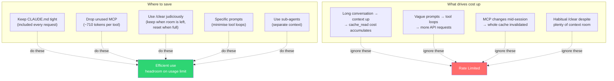

---

## 11. References

### Anthropic official docs
- [Pricing](https://platform.claude.com/docs/en/about-claude/pricing)
- [Prompt Caching](https://platform.claude.com/docs/en/build-with-claude/prompt-caching)
- [Models Overview](https://platform.claude.com/docs/en/about-claude/models)
- [Claude Code Costs](https://code.claude.com/docs/en/costs)
- [Claude Code Monitoring](https://code.claude.com/docs/en/monitoring-usage)
- [Claude Code Statusline](https://code.claude.com/docs/en/statusline)

### Technical write-ups
- [How Claude Code Builds a System Prompt](https://www.dbreunig.com/2026/04/04/how-claude-code-builds-a-system-prompt.html) — system-prompt composition
- [Where Do Your Claude Code Tokens Actually Go?](https://dev.to/slima4/where-do-your-claude-code-tokens-actually-go-we-traced-every-single-one-423e) — token flow trace
- [Optimising MCP Server Context Usage](https://scottspence.com/posts/optimising-mcp-server-context-usage-in-claude-code) — MCP context optimisation

### Open-source tools
- [ccusage](https://ccusage.com/guide/) — JSONL-based cost analysis
- [Lupen](https://github.com/) — macOS menu-bar live monitoring (this project)
